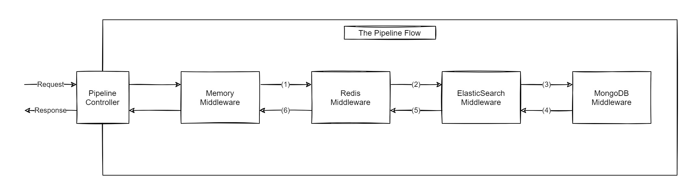

# EasyPipe
[](https://github.com/zoomit-org/EasyPipe/actions/workflows/dotnet.yml)
[](https://www.nuget.org/packages/EasyPipe)


A simple and lightweight library to implement pipelines.

* Written in .NET 5
* No Dependencies
* No Reflection
* Readable and Easy to Use API

## How to Use

Read the following example and follow one of the guidelines below to based on your preference.


You have a system that caches articles in multiple storages for faster retrieval of data. Everytime, a user opens an article to read, the system gos through each storage and check weather the requested article is available. In case the article is found, the storages that don't have the requested data should cache the data. The pipeline design pattern fits this scenario. The diagram below depicts how pipeline works in the this scenario:




Let's convert this scenario to code. First, install the following package:

with Nuget:
```
Install-Package EasyPipe
```

or with .NET CLI:

```
dotnet add package EasyPipe
```

then, create pipeline request and response classes:

```c#
    
    // Request
    public class QueryArticle
    {
        public int ArticleId { get; set; }
    }
    
    // Response
    public class ArticleReadModel
    {
        public string Title { get; set; }
        
        public string Content { get; set; }
    }
```

For each storage, create a middleware that implements `IMiddleware<TRequest, TResponse>` interface.

```c#
    public class MemoryMiddleware : IMiddleware<QueryArticle, ArticleReadModel>
    {
        public async Task<ArticleReadModel> RunAsync(QueryArticle request,
                                                     IPipelineContext context,
                                                     Func<Task<ArticleReadModel>> next,
                                                     CancellationToken cancellationToken)
        {
            // Implementation goes here ...
            
            // call the next handler to continue pipline, or not to discontinue pipeline
            var result = await next();
        }
    }
    
    public class RedisMiddleware : IMiddleware<QueryArticle, ArticleReadModel>
    {
        public async Task<ArticleReadModel> RunAsync(QueryArticle request,
                                                     IPipelineContext context,
                                                     Func<Task<ArticleReadModel>> next,
                                                     CancellationToken cancellationToken)
        {
            // Implementation goes here ...
            
            // call the next handler to continue piplien, or not to discontinue pipeline
            var result = await next();
        }
    }
    
    public class ElasticMiddleware : IMiddleware<QueryArticle, ArticleReadModel>
    {
        public async Task<ArticleReadModel> RunAsync(QueryArticle request,
                                                     IPipelineContext context,
                                                     Func<Task<ArticleReadModel>> next,
                                                     CancellationToken cancellationToken)
        {
            // Implementation goes here ...
            
            // call the next handler to continue piplien, or not to discontinue pipeline
            var result = await next();
        }
    }    
    
    public class MongoMiddleware : IMiddleware<QueryArticle, ArticleReadModel>
    {
        public async Task<ArticleReadModel> RunAsync(QueryArticle request,
                                                     IPipelineContext context,
                                                     Func<Task<ArticleReadModel>> next,
                                                     CancellationToken cancellationToken)
        {
            // Implementation goes here ...
            
            // call the next handler to continue piplien, or not to discontinue pipeline
            var result = await next();           
        }
    }
```

Finally, follow guidelines below to setup and use your pipeline. 

### Setup a Pipeline in ASP.NET Core

Install the following packages:

with Nuget:
```
Install-Package EasyPipe
Install-Package EasyPipe.Extensions.MicrosoftDependencyInjection
```

or with .NET CLI:

```
dotnet add package EasyPipe
dotnet add package EasyPipe.Extensions.MicrosoftDependencyInjection
```

Then, setup your chain in the `ConfigureServices` method of `Startup.cs`

```c#
    services.AddPipeline<QueryArticle, ArticleReadModel>()
            .WithMiddleware<MemoryMiddleware>()
            .WithMiddleware<RedisMiddleware>()
            .WithMiddleware<ElasticMiddleware>()
            .WithMiddleware<MongoMiddleware>();
```

Inject your pipeline to your desired class and run it

```c#
    [ApiController]
    [Route("[controller]")]
    public class Controller
    {
        private readonly IPipeline<QueryArticle, ArticleReadModel> _pipeline;

        public Controller(IPipeline<QueryArticle, ArticleReadModel> pipeline)
        {
            _pipeline = pipeline;
        }

        [HttpGet]
        public async Task<IActionResult> Get(QueryArticle query)
        {
            var result = await _pipeline.RunAsync(query);

            return Ok(result);
        }
    }
```
